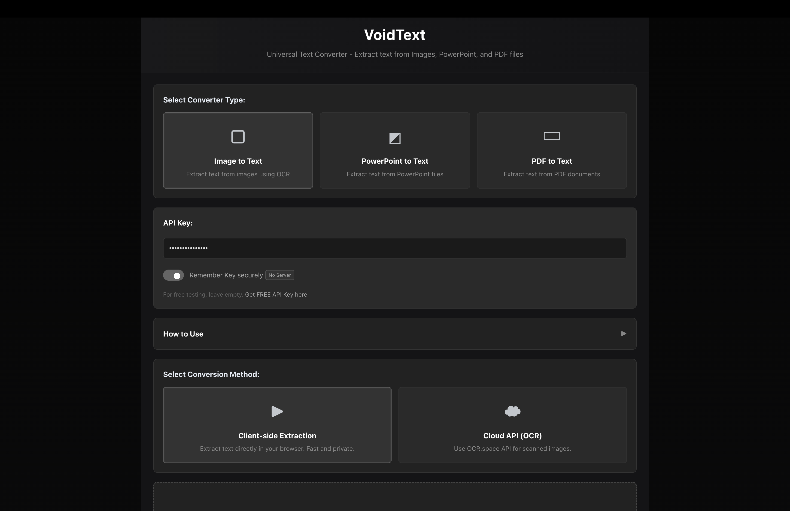

# VoidText

**Universal Text Extractor** – Extract text from Images, PowerPoint, and PDF files.

---

## Features

- **Image to Text**: Extract text from images using OCR (Tesseract.js or Cloud API).
- **PowerPoint to Text**: Extract text from `.pptx` or `.ppt` slides.
- **PDF to Text**: Extract text from text-based PDFs or scanned PDFs using OCR.
- **Client-side processing**: Convert files directly in your browser for privacy and speed.
- **Cloud API support**: Optional OCR.space API integration for better accuracy on scanned files.
- **Copy individual or all text**: Easily copy extracted content.
- **Undo & Remove**: Remove extracted items and undo actions.
- **Responsive Design**: Works on all devices and screen sizes.

---

## Usage

1. Open the **VoidText** website.
2. Select the file type you want to convert (Image, PowerPoint, PDF).
3. Upload your files using drag & drop or file browser.
4. Choose conversion method:
   - **Client-side**: Fast and private, works directly in the browser.
   - **Cloud API**: Optional, requires OCR.space API key for scanned files.
5. Click **Convert to Text**.
6. Copy individual results or all extracted text.

---

## Screenshots

---

## Technologies Used

- HTML, CSS, JavaScript
- [Tesseract.js](https://github.com/naptha/tesseract.js) for OCR
- [PDF.js](https://mozilla.github.io/pdf.js/) for PDF parsing
- [PizZip](https://github.com/open-xml-templating/pizzip) + [Docxtemplater](https://docxtemplater.com/) for PowerPoint extraction

---

## Tags

`OCR` `Text Extraction` `PDF` `PowerPoint` `Image to Text` `Client-side` `Responsive` `Web App` `JavaScript` `Tesseract.js`

---

## License

MIT License
